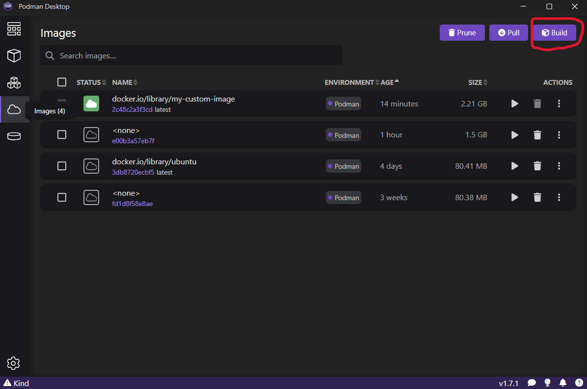

# Container Use Instructions
## Podman Desktop App *
 
 When using the Podman desktop app to create the container image :
1. Open the images tab and select the build option

2. In the Containterfile path browse to the location of the Dockerfile in .gihub/workflows and select the file

3. Enter a name for the image and click the build button
4. Once the image is built it will appear in the images tab. To create a container from the image click the run button

5. Give the container a name and mount the pymgm repo using the Volume option to the location of the code on the host machine.
   For the path inside the container enter `/app` 

6. Scroll down and press start container to start the container. \
*This assumes that Podman desktop app is installed and a Podman machine is created and configured
## Podman CLI
