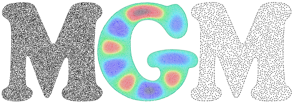

# BSU CS481 Capstone - pyMGM


  


# Python Meshfree Geometric Multilevel (pyMGM) Method 

   

## Introduction

This repository provides a Python implementation of the Meshfree Geometric Multilevel (MGM) Method, originally developed by Dr. Grady Wright,
Professor at Boise State University, and his collaborators. The MGM method is designed for solving elliptic equations on surfaces, particularly
suited for problems arising in computational science and engineering.

## Overview
The MGM method offers a powerful approach to solve and precondition linear systems resulting from meshfree discretizations of elliptic equations.
It encompasses algorithms for both 2D surfaces embedded in 3D space and 2D/3D Euclidean domains with boundaries. This Python implementation extends
the capabilities of the original MGM method for 2D surfaces, allowing users to leverage its functionality within the Python ecosystem.
For quick reference on the current features and limitations of pyMGM, please see the [Quick Reference](#quick-reference) section below.

## Features
- Current package structure designed for easy installation for testing purposes, compatible with PyPI test environment. 
Future updates will add the package to the PyPI repository for  pip install functionality.
- Integration with common Python libraries for numerical computing and visualization.
- C++ backend for computationally intensive tasks, interfaced with Python using pybind.
- compatability with python versions 3.10 and above.

## Build instructions
The code makes use of the weighted sample elmination (WSE) method from the [cyCodeBase Package](https://github.com/cemyuksel/cyCodeBase).  This method is implemented in C++ and the mgm
package includes pybind interface files in the `+util` directory to access this method.  However, before you can use pyMGM, the shared object (so) files must
be compiled on your machine. Below are the instructions to build these files, which only has to be done once after cloning the repository.

1.  Clone the repository and navigate to the root directory of the repository
2.  Using terminal enter the following command to compile the shared object files and link to the python interface files:
    ```
    g++ -O3 -Wall -shared -std=c++11 -fPIC `python3 -m pybind11 --includes` src/pymgm_test/utils/bindings.cpp src/pymgm_test/utils/PcCoarsen2D.cpp -o src/pymgm_test/utils/PcCoarsen`python3-config --extension-suffix`
    ```

    This should create a .so file in the `src/pymgm_test/utils/` directory.


Note that currently the files from the [cyCodeBase Package](https://github.com/cemyuksel/cyCodeBase) are included in this repository.  However, once this repository is made public, users will be required to clone the [cyCodeBase Package](https://github.com/cemyuksel/cyCodeBase) to their machine.  Depending on the location where this package is cloned, the build instructions above may change.

## Setting the Python path
To use the pyMGM library you will need to add the top level folder  to the Python path.  This can be done as follows:
1.  Using the terminal command line, change the working directory to where you cloned the repository
2.  On the command line execute the commands `export PYTHONPATH=$PYTHONPATH:$(pwd)`.  This will add the top level folder to the Python path. 
3. If you are using Windows, you can use the command `set PYTHONPATH=%PYTHONPATH%;%cd%`


## Example of using the repository
MGM was initially developed as a multilevel method for solving/preconditioning linear systems that arise for meshfree discretizations of elliptic equations on 2D surfaces embedded in 3D space as described in [1].  However, we have found that it also appears to work for other discretizations and for Euclidean domains with boundaries.  In this sense, the method can be used as a black-box solver for systems $L_h u_h = f_h$ corresponding to the discretization of an elliptic PDE over a domain $\Omega$.

The inputs for MGM are simple:
- The $N\times N$ matrix $L_h$ stored as a _sparse_ MATLAB matrix `Lh` 
- The point cloud $X$ (or nodes) that was used in the construction of `Lh`, stored as a $N\times d$ MATLAB matrix `X`, where $d$ is the dimension of (embedding) space. For nodal FE discretizations, $X$ would be the quadrature nodes over the elements of the mesh (without repeats). 
- The area/volume of the underlying domain $\Omega$ of the PDE, stored as a scalar value `domainVol`
- boolean - hasConstNullSpace (not yet implemented for value of True) if the system has a constant null space
- boolean - verbose as a flag indicating whether diagnostics should be printed

With these three components, one first sets up the MGM method, which consists of computing the point sets and discrete operators on the various coarser levels

After importing the mgm2D class from  src.pymgm_test.mgm2d.mgm2d within the project an instance of the class can be created by calling:
```
# For a 2D Euclidean domain:
mgm = mgm2D(Lh,X,domainVol, False, 1)
```
 
Note:
-  This step only needs to be done once for a given `Lh`.

The following code is then used to solve the system for a given right hand side `fh` using the default acceleration method of 'none'
```
uh,flag,relres,iters,resvec = mgmobj.solve(mgm.obj,fh,tol,'none');
```

Note: 
- The parameters for tolerance, acceleration method, and max iterations are optional values a call using user defined values for these parameters may look like: 

```
uh,flag,relres,iters,resvec = mgmobj.solve(mgm.obj,fh,tol,'none', True, 100);
```
See the help text of `mgm.solve` for a description of the outputs and other optional input arguments.


### Problems with a one dimensional nullspace (NOT YET IMPLEMENTED)
For PDEs such as the surface Poisson problem or Poisson problems on Euclidean domains with pure Neumann boundary conditions the matrix $L_h$ will have a one dimensional nullspace corresponding to constant vectors.  In these cases where there is a one-dimensional nullspace, it is necessary to alter the above construction procedure.  For example, for the surface problem one would instead do:
```
% For a 2D surface embedded in 3D space where Lh has a one dimensional nullspace (e.g. surface Poisson problem)
mgmobj = mgm2D(Lh,X,domainVol,True, 1)
```
Again see the help text of `mgm2ds`, `mgm2d`, or `mgm3d` for a description of other optional input arguments.

## Demo using `util.squarepoisson`
The `util.squarepoisson` function generates a square poisson distribution problem with matrices, points, right hand sides, and exact solutions already computed
from a given n for an $N\times N$ matrix. For the current implementation of pyMGM n &ge; 50 is recommended. <br><br>
Below is an example using this with pyMGM
```
Lh, x, vol, fh, uexact = squarepoissond(50)
# Set-up MGM2D for this problem
mgm = mgm2D(Lh,x,vol,False,1)
# Solve the linear system using pyMGM with default acceleration of 'none'
uh,flag,relres,iters,resvec = mgm.solve(mgm.obj,fh,1e-10,'none',100)
```
To optionally create a plot of the solution, the following code can be used:
```
import matplotlib.pyplot as plt

# Scatter plot of the solution
plt.figure()
plt.scatter(x[:, 0], x[:, 1], c=uh, cmap='viridis', s=20)
plt.colorbar(label='Solution')
plt.title('Scatter plot of the solution')
plt.xlabel('x')
plt.ylabel('y')
plt.show()
```

## Quick Reference: Not Yet Implemented Features: <a name="quick-reference"></a>
- The `hasConstNullSpace` parameter for a value of True is not yet implemented.  The MGM method is designed to handle systems with a one-dimensional nullspace, but this feature is not yet implemented in the current version of pyMGM.
- 2Ds and 3Ds are not yet implemented.  The current version of pyMGM only supports 2D Euclidean domains.
- pip install for the package not yet available.  The current version of pyMGM must be built from source.
- BIGCSTAB acceleration method has an implementation but currently does not return relres, iters, resvec. Only the solution and convergence flag are returned.
- GMRES acceleration not yet implemented.

## References:

[1] G. B. Wright, A. M. Jones, and V. Shankar . MGM: A meshfree geometric multilevel method for systems arising from elliptic equations on point cloud surfaces. _SIAM J. Sci. Comput.,_ 45, A312-A337 (2023) ([arxiv](http://arxiv.org/abs/2204.06154), [journal](https://epubs.siam.org/doi/10.1137/22M1490338))
<br><br><br><br>
<div style="text-align: center;">
    
    <p>This website/app was created for a <br>
    Boise State University <br>
    Computer Science Senior Design Project by <br>
    Sean Calkins<br>
    Tanner Frost<br>
    Paul Vanderveen<br>
    For information about sponsoring a project go to <br>
    <a href="https://www.boisestate.edu/coen-cs/community/cs481-senior-design-project/">https://www.boisestate.edu/coen-cs/community/cs481-senior-design-project/</a>
    </p>
</div>