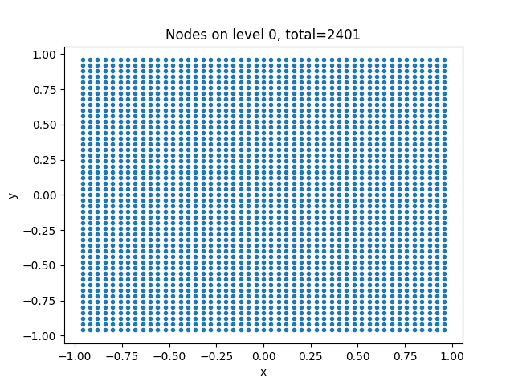
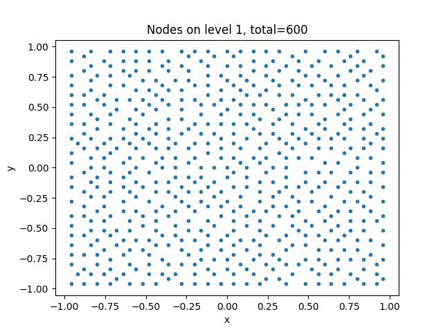
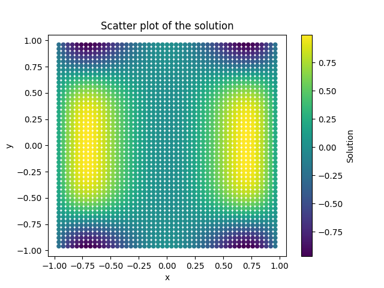

# pyMGM 
## Abstract
Dr. Grady Wright, a professor at Boise State in the Math Department, and his fellow researchers, 
Varun Shankar (University of Utah) and Andrew Jones (Sandia National Labs) have developed a general method
(meshfree geometric multilevel or MGM) which can solve large linear systems of equations derived from discretizing
elliptic PDEs on surfaces represented by a set of points (point clouds). This technique uses a Poisson disk sampling-type
method to downsample points in the space, and an interpolation operator to upsample points, deriving a more accurate
solution in the process. An implementation of this algorithm is currently in MATLAB, and we set out to make it more accessible
and user-friendly by translating the MGM algorithm to Python.
  
The goal of this Python implementation of the MGM algorithm was to create a Python package that operates similar to the original
MATLAB implementation.  While a 1:1 translation was not possible due to the differences in the languages, the Python implementation
of the MGM algorithm is designed to be similar enough to the MATLAB implementation that users familiar with the MATLAB version
will be able to use the Python version with minimal effort.  

## Meshers Team Members
- Sean Calkins
- Tanner Frost
- Paul Vanderveen

## Project Description
The goal of this project was to translate the MATLAB implementation of the MGM algorithm to Python. Using data and results from the MATLAB
implementation, we were able to create a Python package that operates in a similar manner. We wanted to make the package pip installable
so the project structure is set up to be added to the Python Package Index (PyPI). Dr Wright will set up and publish the package to PyPI so 
that it can be easily installed by users, so they can import the package and use the MGM algorithm in their own projects.
  
The bulk of the algorithm is contained within the abstract mgm class and the mgm2D classes. These classes contain the functions for setting up the
data structures used within the algorithm, and the functions for running the algorithm. Within the first step of the algorithm, the data goes through
a pre-processing phase where the data is coarsened from their fine point cloud structures to multiple levels of gradually coarser point clouds.
Using a C++ library that is bound to Python using the pybind package. The algorithm then goes through a series of iterations where the data is
interpolated and restricted between levels of the point clouds. The algorithm then solves the linear system of equations at each level of the point cloud.
  
There is a function to visualize the different levels of coarseness called plot() that plots the values at each level to create a graphical representation
of the data. In the projects README file code is provided to plot the solution of the MGM algorithm. Plots of the levels of data look like:

The solution is depicted as a scatter plot with an example of a solution using a square poisson distrubution looking like:
